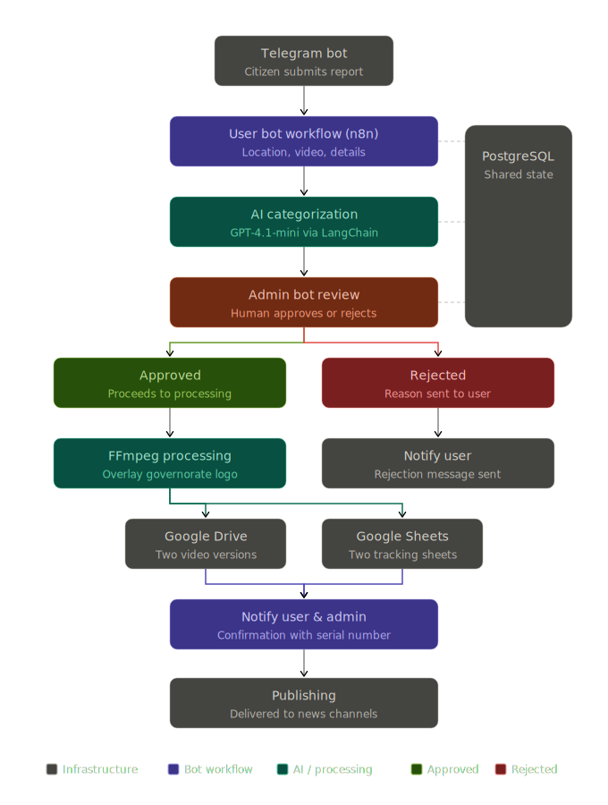

# 🚀 AI Social Media Publishing Automation

> An end-to-end AI-powered content publishing system that automates the journey from user submission to multi-platform social media publishing.

---

# 📖 Overview

This project is a production-grade AI automation platform designed to streamline social media content publishing.

The system allows users to submit videos through Telegram, routes the content through an approval workflow, automatically processes approved media using FFmpeg, enriches the content with AI-generated metadata, and publishes it across multiple social media platforms.

The platform is designed to eliminate repetitive manual work while ensuring every published video passes through an administrative approval process.

---

# 🎯 Business Problem

Publishing video content manually requires multiple repetitive steps:

- Receiving videos from contributors
- Reviewing submitted content
- Editing videos
- Preparing captions
- Publishing on multiple platforms
- Tracking publishing status

This process consumes significant time and introduces unnecessary operational overhead.

---

# 💡 Solution

The automation platform transforms the entire publishing pipeline into a fully automated workflow.

Instead of manually handling each submission, the system automatically:

- Receives video submissions from Telegram
- Stores submission data
- Routes content for administrative review
- Processes approved videos using FFmpeg
- Publishes the final content across multiple platforms

---

# 🏗 System Architecture

The solution consists of two independent automation pipelines.

## 1️⃣ User Submission Workflow

Responsible for:

- Receiving videos from Telegram
- Collecting submission metadata
- Storing information in PostgreSQL & Supabase
- Forwarding submissions to the admin workflow

---

## 2️⃣ Admin Publishing Workflow

Responsible for:

- Reviewing submitted content
- Approving or rejecting videos
- Processing approved videos with FFmpeg
- Preparing content for publishing
- Publishing to all configured social platforms

---

# ⚙️ System Architecture

---

# ✨ Features

- 📥 Telegram video submission
- 👤 Separate user & admin workflows
- ✅ Approval / rejection system
- 🎬 Automated video processing using FFmpeg
- 🗂 Database integration
- 📡 Multi-platform publishing
- 🔄 End-to-end automation
- 📊 Workflow status tracking

---

# 🛠 Tech Stack

### Automation

- n8n

### Programming

- JavaScript

### AI

- OpenAI API

### Databases

- PostgreSQL
- Supabase

### Media Processing

- FFmpeg

### Integrations

- Telegram Bot API
- Social Media APIs

---

# ⚡ Engineering Challenges

### Multi-stage Approval Workflow

Designed two independent automation pipelines to separate user submissions from administrative publishing while maintaining synchronization between both workflows.

---

### Automated Media Processing

Integrated FFmpeg into the workflow to automatically process approved videos before distribution.

---

### Multi-platform Distribution

Built a centralized publishing pipeline capable of distributing content to multiple social media platforms from a single approval action.

---

### Data Synchronization

Maintained consistent state management across Telegram, PostgreSQL, Supabase, and publishing services.

---

# 📈 Results

- Reduced repetitive manual publishing tasks
- Standardized the publishing workflow
- Improved publishing consistency
- Automated media processing
- Enabled centralized content management

---

# 🔒 Security & Privacy

The original workflow, implementation details, and business logic belong to the client.

For confidentiality reasons, this repository intentionally excludes:

- Workflow JSON
- API credentials
- Internal business logic
- Client assets
- Production configuration

This repository demonstrates the overall system architecture, engineering approach, and technical implementation without exposing proprietary information.

---

# 📸 Screenshots

> *(Screenshots of the workflow, architecture, and publishing dashboard can be added here after removing any sensitive information.)*

---

# 🎥 Demo

A short demonstration video showing the workflow execution and publishing process will be available here.

---

# 👩‍💻 Author

**Asmaa Saeed**

AI Automation Engineer

Specialized in:

- AI Agents
- n8n Automation
- Workflow Automation
- LLM Applications
- OpenAI Integrations
- API Development
